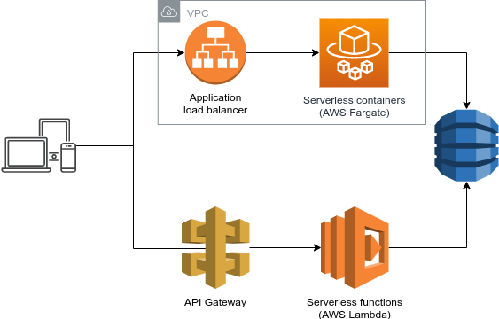

This repository contains the same example application twice:

1. **Serverless functions**: [AWS Lambda functions](https://aws.amazon.com/lambda/) with an [API Gateway](https://aws.amazon.com/api-gateway/)
2. **Serverless containers**: [AWS Fargate](https://aws.amazon.com/fargate/) (ECS) containers with a [load balancer](https://aws.amazon.com/elasticloadbalancing/)

The examples are meant to make it easy to compare both alternatives.

A common demo UI is provided (`html/index.html`) that allows switching between the two backends. Both versions use the same storage (a `DynamoDB` table) and share the same code (`src/common.py`). Wrappers are provided to handle the API Gateway events (Functions approach) or serve a simple Flask-based REST endpoint (Container approach). Deploying the stack will update the URLs in the demo UI (`src/urls.js`), which can be opend locally, or potentially be deployed to S3/CloudFront or elsewhere.


The full stack is defined in an [AWS CloudFormation](https://aws.amazon.com/cloudformation/) template (`template.yaml`), backed by [AWS SAM](https://docs.aws.amazon.com/serverless-application-model/latest/developerguide/what-is-sam.html). Deployment includes a few additional steps, so a deployment script has been provided (`deploy.sh`).



Note that this repo is meant as a demo, and **the stack only includes the absolute minimum necessary to create a working app**. This demo is not meant to be used as template for production-ready applications. The CloudFormation template includes some hints about missing resources and security good practices.

It's interesting to look at the differences between both stacks:
- **containers need plenty of components**: even if both approaches are "serverless" in the sense that we don't have to manage EC2 instances, the Container approach still needs an awful large amount of components to get started. The Lambda/API Gateway approach, in contrast, already comes with load balancing, concurrency, auto-scaling, and a VPC built-in. The `AWS SAM` framework comes with some handy 'meta' serverless resources; it might be time to create similar shortcuts for containers (`AWS::Serverless::Container`)?
- **Endpoint configuration**: the Lambda variant configures the REST endpoints inside the CloudFormation template (and hence the endpoints scale independently), while the container variant has them all served together configured in code (although multiple containers & scaling policies could be made if necessary). The **payloads** are also slightly different due to the API Gateway proxy event vs the Flask (or another) framework.

## Prerequisites
- Install the [AWS CLI](https://docs.aws.amazon.com/cli/latest/userguide/cli-chap-install.html) (if you didn't already)
- Install the [AWS SAM CLI](https://docs.aws.amazon.com/serverless-application-model/latest/developerguide/serverless-sam-cli-install.html) (if you didn't already)
- Install [Docker](https://docs.docker.com/install/) (if you didn't already)


## Deploy
```
export DOCKER_IMAGE=${your-dockerhub-username}/serverless-blog

./deploy.sh

# now open or refresh html/index.html
```


## Test locally
Note that actual HTTP calls require an existing DynamoDB table.

```
sam build

# 1) test locally, behind full API
# note: can keep the API running, but run 'sam build' after changes
sam local start-api
http GET http://127.0.0.1:3000/blog/
# or perform a raw function call (without API)
sam local invoke GetBlog --event <(echo '{"id": "foo"}') | jq .

# 2) test locally, Docker container
export TABLE_NAME=$SOME_DYNAMODB_TABLE
docker build -t blog .
docker run -it -p 5000:80 -v $PWD/src:/app -v ~/.aws:/root/.aws -e TABLE_NAME blog
# note: can keep the container running; the code will auto-reload
http GET http://127.0.0.1:5000/blog/
```


